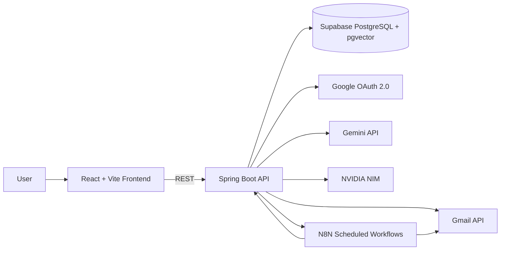

# AI-Powered Gmail Intelligence Platform Architecture

## 1. System Architecture

The frontend handles inbox exploration, thread views, chat, and draft review. The backend owns authentication, Gmail sync, AI orchestration, retrieval, persistence, and auditability. N8N is reserved for scheduled and pipeline-oriented automation only.

## 2. Database Schema

### Core Tables

- `app_user` - authenticated application user profile
- `gmail_connection` - encrypted Google OAuth tokens and sync state
- `email_thread` - Gmail thread metadata, labels, category, summary
- `email_message` - individual Gmail messages with headers and content
- `email_embedding` - pgvector-backed embeddings for message and thread retrieval
- `sync_cursor` - history ID and incremental sync checkpoint
- `chat_conversation` - conversational sessions with the assistant
- `chat_message` - assistant and user messages with citations
- `draft_email` - AI-generated compose/reply drafts and send status
- `newsletter_item` - deduplicated newsletter stories with source attribution

### Modeling Decisions

- Threads are first-class because summarization, reply drafting, and chat reasoning all need thread context.
- `pgvector` stores embeddings for retrieval over messages, threads, and newsletter items.
- Incremental sync uses Gmail `historyId` checkpoints to avoid full reprocessing.
- OAuth tokens are stored encrypted at rest.

## 3. AI Design

### Summarization

- Individual message summary: short, factual, source-preserving.
- Thread summary: generated from the full thread transcript, ordered by timestamp.
- Long threads are chunked by message order and merged into a final summary.

### RAG Pipeline

1. User question is normalized and embedded.
2. Top-k related messages, threads, and newsletter items are retrieved from pgvector.
3. Retrieved items are reranked by recency, sender relevance, and thread affinity.
4. Gemini generates the final answer with citations.

### Source Clarity

Every response includes structured citations with:

- thread ID
- message ID
- sender
- timestamp
- snippet used for reasoning

### Model Roles

- Gemini: primary summarization, drafting, chat generation, and reasoning.
- NVIDIA NIM: fallback or secondary reasoning path for comparison, resilience, and free-tier flexibility.

### Hallucination Prevention

- The assistant is restricted to retrieved email evidence.
- If evidence is missing, the model must say so explicitly.
- Answers are constrained to cited sources only.
- Thread context is always included for reply generation.

## 4. Gmail API Strategy

### Initial Sync vs Incremental Sync

- Initial sync enumerates threads page-by-page and persists the full conversation history.
- Incremental sync uses `history.list` from the last saved `historyId`.
- Missing history windows fall back to a controlled re-sync of affected threads.

### Pagination

- Gmail list endpoints are always consumed with page tokens.
- Sync jobs store progress after each page to remain resumable.

### Rate Limiting and Quota Handling

- `429` and transient `5xx` responses use exponential backoff with jitter.
- Retry budgets are capped per job.
- The sync cursor is updated only after a successful page or history batch.

## 5. Tool and Technology Decisions

- React + Vite + TypeScript: fast iteration with maintainable frontend types.
- Spring Boot 3 + Java 21: strong enterprise backend fit and clean layering.
- Supabase PostgreSQL + pgvector: managed PostgreSQL with vector search in one system.
- N8N: scheduled automation only, to keep core business logic in Spring Boot.
- Gemini + NVIDIA NIM: primary/secondary model strategy for reliability and vendor flexibility.

## 6. Trade-offs and Limitations

- The submission prioritizes the core Gmail intelligence workflows over a fully generalized multi-tenant platform.
- Newsletter deduplication is implemented as a focused pipeline rather than a large content platform.
- Real Gmail OAuth consent, Supabase provisioning, and deployment credentials must be configured manually.
- Deeper analytics and long-term conversation memory are intentionally deferred.
